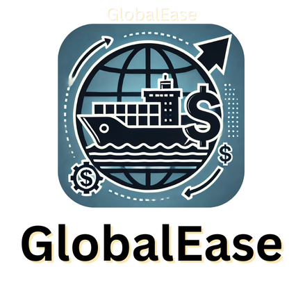

<!-- PROJECT LOGO -->
<div align="center">
  
  <h1 align="center"><b>GlobalEase: AI tool that simplifies international expansion by 
  streamlining compliance, market analysis, and financial support</b></h1>
</div>

<!-- ABOUT THE PROJECT -->
<br>

## ♾️ Problem Statement

Create a gen-ai-powered tool to simplify cross-border regulations and govt incentives for sellers in e-commerce.

## ♾️ Solution

- GlobalEase is designed to help companies expand internationally by addressing complex compliance, market knowledge, financial support, and regulatory challenges. We plan to build a comprehensive tool powered by Generative AI (GenAI) and machine learning that simplifies these challenges into clear, actionable insights.
- Compliance Management Tool Powered by GenAI:Using GenAI, Automatically gather, categorize, and analyze regulatory information (like material restrictions, labeling standards, and environmental rules) from government websites and industry databases. The tool will then provide simplified summaries or explanations, making complex regulations easier to understand.
- AI-Driven Matching for Financial Support and Incentives: Companies can quickly find and apply for financial support, helping them offset expansion costs and stay competitive.

## ⚙️ Built With

The technologies and tools used are:

- LLM
- Langchain
- Groq
- Pinecone
- NLP
- HTML
- CSS
- Javascript
- Python
- NodeJS
- ExpressJS
- Bootstrap

<!-- GETTING STARTED -->

## 🧑‍💻 Getting Started

### Installation

1. Clone the repository

   ```sh
   git clone https://github.com/sanketdisale871/Squadron_AmazonSmbhav.git
   ```

2. Install the dependencies:

   ```sh
   npm i
   ```

3. Start Application:
   ```sh
   nodemon index.js
   ```

## 💡 Innovation Highlights

- Why Users Choose GlobalEase?
  GlobalEase stands out because it provides a comprehensive, AI-driven platform specifically designed to ease the complexities of international expansion. Unlike traditional solutions that may address only one aspect of cross-border trade, GlobalEase integrates compliance management, market insights, and financial support in a single, user-friendly tool.'
- AI-Powered Compliance Simplification: GlobalEase uses Generative AIto automatically gather and translate regulatory data, breaking down complex legal language into simplified summaries. This gives users a clear, quick understanding of requirements tailored to each market—a major improvement over manual research or generalized information.
- Real-Time Market and Regulatory Monitoring: Leveraging real-time data scraping and machine learning, GlobalEase continuously tracks and updates regulatory changes and emerging market trends.
- Smart Incentive Matching: Through advanced NLP algorithms, GlobalEase identifies and matches businesses with relevant grants, tax breaks, and incentives, based on their unique profiles.

<!-- CONTRIBUTING -->

## Some Glimpses of WorkConnect

- Login & Registration
  
  

- Dashboard
  
  

- GlobalEase GPT
  
  
  

- Portals
  

